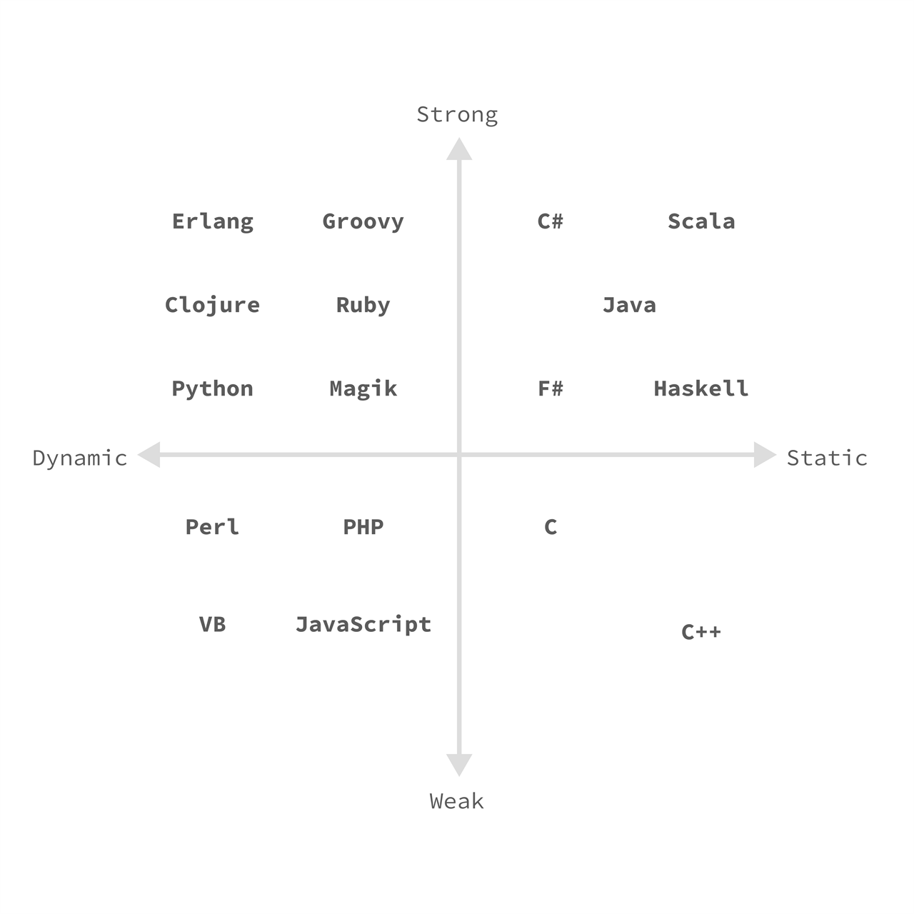

# 第 1 章 类型、对象、实例和变量

## 类型
> Python 是动态的强类型语言；Python 的类型系统属于 Duck（鸭子）类型。


### 动态类型与静态类型

一门编程语言是静态类型还是动态类型，是根据其类型检查是在编译期执行还是在运行期执行。如果在编译期执行类型检查，那就是静态类型，否则就是动态类型。

对于静态类型语言，一般有两种现象：（1）在声明变量时，要指定其类型；（2）变量一旦声明后，其类型不允许被改变。

而对于动态类型语言，一般也有两种现象：（1）在声明变量时，不须要指定其类型；（2）变量声明后，其类型仍可以动态地被改变。

上述两种现象并不矛盾，如果想要在编译期执行类型检查，那么就要要求变量的类型在声明时就要确定下来，而且之后不能被改变，否则就无法在编译时确定一个变量的类型，只能在运行时，动态地检查变量的类型，然后再根据其类型判断其操作是否合法。

最近一些静态语言为了方便编写，也加入了一个特性：自动推导。即，编译器根据上下文自动推断出一个变量的类型。尽管这种特性不要求程序写明确地写出类型，但仍旧须要在编译时确定变量的类型，只不过它是隐式地（由编译器自动完成），而且该变量的类型被自动地推导出来之后，其类型就固定了，之后也不允许被改变。

另外，由于静态语言在声明时就已经知道了其类型，因此在运行时，可以对其进行更多的优化；反观动态语言，只有在运行时才能知道其类型，因此优化起来比静态语言要难得多。为了使解析器尽可能地进行优化，一些动态语言也支持在声明变量时指定其类型，且**约定**在运行时不会改变其类型（如 Python 从 3.6 开始支持变量类型注解），但这并不代表变量的类型不能被改变。

因此，判断一门语言是动态类型还是静态类型，可以简单地依据以下两个条件：
1. 声明变量时，是否 **`必须`** 要指定其类型。
2. 变量被声明后，是否可以改变其类型。

依据这两个判断条件，我们可以认为，`JavaScript`、`PHP`、`Python`、`Ruby` 等是动态语言，`C/C++`、`Java`、`C#`、`Go` 等是静态语言。


### 强类型与弱类型

一门编程语言是强类型语言还是弱类型语言，是根据其类型检查的严格程度。

相对于强类型语言，弱类型语言的类型检查不是很严格，倾向于容忍隐式类型转换，比如：形参类型是 `double` 的 C 函数，在调用时，可以传递 `int` 值作为其调用实参。而强类型语言一般不允许这么做，如 Go 语言禁止传递 `int` 类型值给 `double` 类型的参数(注：Go 中的 `double` 类型叫 `float64`)。

因此，我们可以认为，`C/C++`、`JavaScript` 等是弱类型的，而 `C#`、`Go`、`Java`、`Python` 等是强类型的。但这并不是绝对的或一定的，只能是是相对的或者是偏向于。用下面一张图可以很好地说明这个问题。



从上图可以看出，相对于 `C#`、`Java`，`Python` 是弱类型的；但相对于 `JavaScript`、`PHP`，`Python` 却是强类型的。


### Duck 类型

> 当看到一只鸟走起来像鸭子、游泳起来像鸭子、叫起来也像鸭子，那么这只鸟就可以被称为鸭子。   —— James Whitcomb Riley

简单地说，Duck 类型就是：**`一个对象有效的语义，不是由继承自指定的类（通过类继承）或实现特定的接口（如 Java 中 interface），而是由该对象的当前方法和属性的集合来决定；在 Duck 类型中，关注的并不是对象的类型本身，而是该对象是如何使用`**。

在 Duck 类型系统中，只要想访问一个对象的属性或调用它的方法，不管该对象是何种类型，只要该对象拥有此属性或方法，就可以访问成功或调用成功。

比如：在 Python 中，定义了一个类型 `A` 以及它的一个实例 `a`，类型 `A` 及其父类中并没有定义方法 `printf()`，但并不代表实例 `a` 不能调用它；在 Duck 类型中，可以在类型 `A` 定义外向它的方法方法和属性集合中添加一个方法 `printf()`，此时就可以调用 `printf()` 了，如：

```python
>>> class A: pass
>>> a = A()
>>> a.printf = lambda: "hello"   # 向实例 a 的方法和属性集体中添加一个方法 printf
>>> print(a.printf())            # 打印字符串 "hello" 到终端上
>>> A.pp = lambda self: "hello"  # 向类型 A 的方法和属性集体中添加一个方法 pp
>>> print(a.pp())                # 打印字符串 "hello" 到终端上
```

细心的读者可能已经发现：
1. 为实例 `a` 添加方法时，`lambda` 表达式没有指定参数，而为类型 `A` 添加方法时，`lambda` 表达式却指定了参数。
2. 为类型 `A` 添加了方法但没有为实例 `a` 添加该方法，而实例 `a` 却能调用该方法。

关于这两个问题，先留给读者思考一下，后续章节会专门解答这两个问题。
